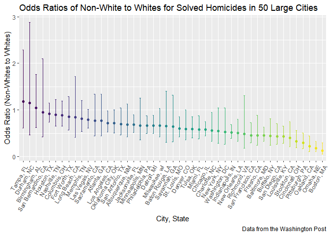

P8105 Homework 6: Linear Models
================
Annie Clark
November 16, 2018

``` r
library(tidyverse)
```

    ## -- Attaching packages -------------------------------------------------------------------- tidyverse 1.2.1 --

    ## v ggplot2 3.0.0     v purrr   0.2.5
    ## v tibble  1.4.2     v dplyr   0.7.6
    ## v tidyr   0.8.1     v stringr 1.3.1
    ## v readr   1.1.1     v forcats 0.3.0

    ## -- Conflicts ----------------------------------------------------------------------- tidyverse_conflicts() --
    ## x dplyr::filter() masks stats::filter()
    ## x dplyr::lag()    masks stats::lag()

``` r
library(forcats)
library(purrr)
library(viridis)
```

    ## Loading required package: viridisLite

Problem 1
=========

The Washington Post has gathered data on homicides in 50 large U.S. cities and made the data available through a GitHub repository here. You can read their accompanying article here.

Part 1: Load the data
---------------------

``` r
homicide_url = "https://raw.githubusercontent.com/washingtonpost/data-homicides/master/homicide-data.csv"

## Read in data from github
homicide_data = 
  read.csv(url(homicide_url)) %>% 
  janitor::clean_names() %>% 
  as_tibble()
```

Part 2: Create some variables and clean data
--------------------------------------------

Create a city\_state variable (e.g. “Baltimore, MD”), and a binary variable indicating whether the homicide is solved. Omit cities Dallas, TX; Phoenix, AZ; and Kansas City, MO – these don’t report victim race. Also omit Tulsa, AL – this is a data entry mistake. Modifiy victim\_race to have categories white and non-white, with white as the reference category. Be sure that victim\_age is numeric.

``` r
## create city_state var and filter out cities
homicide_data =
  homicide_data %>% 
  mutate(city_state = str_c(city, state, sep = ", ")) %>% 
  filter(!(city_state %in% c("Dallas, TX", "Phoenix, AZ", 
                            "Kansas City, MO", "Tulsa, AL")))

## additional tidying  
homicide_data = 
  homicide_data %>% 
  mutate(solved = as.numeric(disposition == "Closed by arrest"),
         victim_race_white = ifelse(victim_race == "White", "white", "nonwhite"),
         victim_race_white = fct_relevel(victim_race_white, ref = "white"),
         victim_age = as.numeric(victim_age))
```

Part 3: Fit a logistic regression model for Baltimore, MD
---------------------------------------------------------

For the city of Baltimore, MD, use the glm function to fit a logistic regression with resolved vs unresolved as the outcome and victim age, sex and race (as just defined) as predictors. Save the output of glm as an R object; apply the broom::tidy to this object; and obtain the estimate and confidence interval of the adjusted odds ratio for solving homicides comparing black victims to white victims keeping all other variables fixed.

``` r
balt_solved_logistic = 
  homicide_data %>% 
  filter (city_state == "Baltimore, MD") %>% 
  glm(solved ~ victim_age + victim_sex + victim_race_white, data = ., family = binomial())

  balt_solved_logistic %>% 
    broom::tidy(conf.int = TRUE) %>% 
    mutate(OR = exp(estimate),
           term = recode(term, victim_sexMale = "victim_sex: male", 
                         victim_race_whitenonwhite = "victim_race: nonwhite")) %>% 
    select(Term = term, "Odds Ratio" = OR, "Conf: Lower bound" = conf.low, 
           "Conf: Upper bound" = conf.high) %>% 
    knitr::kable(digits = 3)
```

| Term                   |  Odds Ratio|  Conf: Lower bound|  Conf: Upper bound|
|:-----------------------|-----------:|------------------:|------------------:|
| (Intercept)            |       2.850|              0.607|              1.496|
| victim\_age            |       0.996|             -0.010|              0.002|
| victim\_sex: male      |       0.413|             -1.153|             -0.619|
| victim\_race: nonwhite |       0.453|             -1.137|             -0.453|

Part 4: Fit a logistical regression model for each city
-------------------------------------------------------

Now run glm for each of the cities in your dataset, and extract the adjusted odds ratio (and CI) for solving homicides comparing black victims to white victims. Do this within a “tidy” pipeline, making use of purrr::map, list columns, and unnest as necessary to create a dataframe with estimated ORs and CIs for each city.

``` r
solved_logistic_function = function(df) {
  glm_fit = glm(solved ~ victim_age + victim_sex + victim_race_white, 
      data = df, family = binomial())
  
  glm_fit %>% 
    broom::tidy() %>% 
    mutate(OR = exp(estimate),
           conf_low = exp(estimate - (1.96 * std.error)), 
           conf_high = exp(estimate + (1.96 * std.error)))
}

## cannot get broom::confint_tidy or broom_tidy(conf.int = TRUE) to work within funciton, therefore had to calculate standard deviations by hand


homocide_odds_city = 
  homicide_data %>% 
  group_by(city_state) %>% 
  nest() %>% 
  mutate(log_models = map(data, solved_logistic_function)) %>% 
  select(-data) %>% 
  unnest() %>% 
  filter(term == "victim_race_whitenonwhite") %>% 
  select(city_state, OR, conf_low, conf_high)
```

Part 5: Make a plot of the models by city
-----------------------------------------

Create a plot that shows the estimated ORs and CIs for each city. Organize cities according to estimated OR, and comment on the plot.

``` r
homocide_odds_city %>% 
  mutate(city_state = fct_reorder(city_state, desc(OR))) %>%
  ggplot(aes(x = city_state, y = OR, color = city_state)) + 
    geom_point() +
    geom_errorbar(aes(ymin = conf_low, ymax = conf_high, width = 0.2)) + 
    theme(axis.text.x = element_text(angle = 60, hjust = 1),
          legend.position = "none") + 
    labs(
        title = "Odds Ratios of Non-White to Whites for Solved Homicides in 50 Large Cities",
        x = "City, State",
        y = "Odds Ratio (Non-Whites to Whites)", 
        caption = "Data from the Washington Post"
      ) +
    viridis::scale_color_viridis(
      discrete = TRUE
    )
```



Problem 2
=========

In this probelm, you will analyze data gathered to understand the effects of several variables on a child’s birthweight. This dataset, available here, consists of roughly 4000 children and includes the following variables:

-   babysex: baby’s sex (male = 1, female = 2)
-   bhead: baby’s head circumference at birth (centimeters)
-   blength: baby’s length at birth (centimeteres)
-   bwt: baby’s birth weight (grams)
-   delwt: mother’s weight at delivery (pounds)
-   fincome: family monthly income (in hundreds, rounded)
-   frace: father’s race (1= White, 2 = Black, 3 = Asian, 4 = Puerto Rican, 8 = Other, 9 = Unknown)
-   gaweeks: gestational age in weeks
-   malform: presence of malformations that could affect weight (0 = absent, 1 = present)
-   menarche: mother’s age at menarche (years)
-   mheigth: mother’s height (inches)
-   momage: mother’s age at delivery (years)
-   mrace: mother’s race (1= White, 2 = Black, 3 = Asian, 4 = Puerto Rican, 8 = Other)
-   parity: number of live births prior to this pregnancy
-   pnumlbw: previous number of low birth weight babies
-   pnumgsa: number of prior small for gestational age babies
-   ppbmi: mother’s pre-pregnancy BMI
-   ppwt: mother’s pre-pregnancy weight (pounds)
-   smoken: average number of cigarettes smoked per day during pregnancy
-   wtgain: mother’s weight gain during pregnancy (pounds)

Part 1: Load the data
---------------------

Load and clean the data for regression analysis (i.e. convert numeric to factor where appropriate, check for missing data, etc.).

Part 2: Fit a regression model predicting birthweight
-----------------------------------------------------

Propose a regression model for birthweight. This model may be based on a hypothesized structure for the factors that underly birthweight, on a data-driven model-building process, or a combination of the two. Describe your modeling process and show a plot of model residuals against fitted values – use add\_predictions and add\_residuals in making this plot.

Part 3: Compare regression model to others
------------------------------------------

Compare your model to two others:

-   One using length at birth and gestational age as predictors (main effects only)
-   One using head circumference, length, sex, and all interactions (including the three-way interaction) between these

Part 4: Cross validate!
-----------------------

Make this comparison in terms of the cross-validated prediction error; use crossv\_mc and functions in purrr as appropriate.
